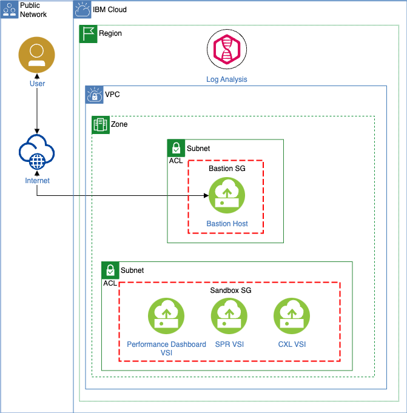

# IBM Cloud Virtual Servers for VPC Sandbox

## Overview

This Terraform module deploys the following VPC infrastructure to deploy sandbox environment on
IBM Cloud:

- VPC
- Subnet
- Public gateway
- Security groups
- IAM Trusted Profile
- Dashboard portal VSI
- Bastion host VSI
- Bastion host FIP
- LogDNA (optional component)

It's recommended to use the IBM Cloud Schematics workspace to deploy the sandbox environment on IBM Cloud
VPC. Using Schematics is *no additional cost* and provides a way for you to easily manage your
Terraform lifecycle.

For more information on IBM Cloud Schematics, see [IBM Cloud Schematics](https://cloud.ibm.com/schematics/overview).

You can run this Terraform module locally when you supply the necessary variables.
See [Assigning values to root module variables](https://www.terraform.io/docs/language/values/variables.html#assigning-values-to-root-module-variables).

You can follow the [Sandbox User Guide](user-guide/sandbox-user-guide.md) to deploy the Sandbox environment on IBM Cloud.

## Setup requirements

### Prerequisites

#### Upgrading your IBM Cloud account

To order and use IBM Cloud services, billing information is required for your account.
See [Upgrading Your Account](https://cloud.ibm.com/docs/account?topic=account-upgrading-account).

#### Install Terraform

If you want to run Terraform locally, see [Install Terraform](https://learn.hashicorp.com/tutorials/terraform/install-cli#install-terraform).

#### IBM Cloud API Key

You must supply an IBM Cloud API key so that Terraform can connect to the IBM Cloud Terraform
provider. This API key is used to order resources by using the identity of the user. For more information, see [Create API Key](https://cloud.ibm.com/docs/account?topic=account-userapikey&interface=ui#create_user_key).

#### IBM Cloud Schematics access policies

You must create the proper Schematics access policies for a user to deploy the sandbox environment on
IBM Cloud VPC using IBM Cloud Schematics. For more information, see [IBM Cloud Schematics Access](https://cloud.ibm.com/docs/schematics?topic=schematics-access).

## Variable behavior

There are a number of variables defined in [variables.tf](./variables.tf) used by this Terraform module to deploy and configure your sandbox infrastructure. See [variables.tf](./variables.tf) for full list of variables with their descriptions, defaults, and conditions.

#### IBM Cloud

When you deploy the sandbox environment on VPC using IBM Cloud topology, the following infrastructure
is created by default:

- 1 x VPC
- 1 x /24 Subnet (256 IPs)
- 1 x Public gateway
- 1 x Dashboard portal VSI
- 1 x Bastion host VSI
- 1 x Bastion host FIP
- 1 x IAM Trusted Profile
- 1 x LogDNA (optional component)
- 2 Security groups

#### Dashboard VSI

Dashboard VSI downloads and installs the sandbox dashboard application, during
post-provisioning using cloud-init/user_data . See [main.tf](main.tf)

- Dashboard Portal can only be accessible from Bastion host.
- You can log into the Dashboard Portal with your username and password and provision the SPR and CLX
  application VSIs.
- To provision the application VSIs, **IAM Trusted Profile** is used to authenticate with
  IBM Cloud.
- You can deploy your own workload by providing your installer and runner scripts from the
  dashboard UI.

NOTE: Don't attach FIP to dashboard VSI; it can only be accessible from the bastion hgost.

#### Bastion host

**Linux Bastion host with VNC Server:** You can access the dashboard portal VSI through the bastion
host only. You can bind/unbind the FIP in the bastion host as per your usage. The bastion
Terraform module provides the commands to access the sandbox dashboard through the bastion tunnel
after successful provisioning of the resources.

#### IAM Trusted Profile

Terraform IAC creates a trusted profile for compute resource identities in IBM Cloud Identity
and Access Management, and then assigns access rights for IAM-enabled services to a virtual server
instance. The following roles are provided to the IAM Trusted profiles: "Writer", "Viewer", "Reader", "Editor.
This profile is used by the dashboard VSI to authenticate with IBM Cloud.

#### Security groups

- Bastion host
- Dashboard VSI

You can pass the `remote_allowed_ips` for the bastion host security group during Terraform provisioning
to open 22(SSH) port for specific IPs. The performance dashboard security group has open traffic for ports
80(UI), 22(SSH) and 8080(API) only for bastion host security group.

#### Post deploy

This Terraform module provides the commands to access the sandbox dashboard application through
the bastion tunnel after successful provisioning of the resources. It provides you with the following command
to run in your local terminal so you can access the sandbox dashboard:

`http://localhost:38080`

`ssh -i [SSHKeyPath] -o StrictHostKeyChecking=no -o UserKnownHostsFile=/dev/null -L
38080:[dashboard-internalIP]:80 root@[bastion_fip].`

## Support

Though the materials provided herein are not supported by the IBM Service organization, your comments are welcomed by the developers, who reserve the right to revise or remove the materials at any time. For reporting a problem, providing suggestions, or comments regarding the IBM Cloud Virtual Servers for VPC Sandbox, users can open a [GitHub issue](https://github.com/IBM-Cloud/sandbox-benchmark-for-vpc/issues). All issues will be addressed as best effort by developers.

Please note that there are no warranties of any kind, and there is no service or technical support available for these materials from IBM. As a recommended practice, carefully review any materials before using them.

If you have problems or questions when you are using the IBM Sandbox for VPC, you can use the following options:

- [User Guide](https://github.com/IBM-Cloud/sandbox-benchmark-for-vpc/blob/main/user-guide/sandbox-user-guide.md)
- [FAQ](https://github.com/IBM-Cloud/sandbox-benchmark-for-vpc/blob/main/user-guide/sandbox-faqs.md)
- Open a [git issue](https://github.com/IBM-Cloud/sandbox-benchmark-for-vpc/issues)

## References

- [What is Terraform](https://www.terraform.io/intro)
- [IBM Cloud provider Terraform getting started](https://cloud.ibm.com/docs/ibm-cloud-provider-for-terraform?topic=ibm-cloud-provider-for-terraform-getting-started)
- [IBM Cloud Schematics](https://cloud.ibm.com/schematics/overview)

<!-- BEGINNING OF PRE-COMMIT-TERRAFORM DOCS HOOK -->
## Requirements

| Name | Version |
|------|---------|
|  [terraform](#requirement\_terraform) | >= 1.0.0 |
|  [ibm](#requirement\_ibm) | 1.62.0 |
|  [random](#requirement\_random) | 3.5.1 |

## Modules

| Name | Source | Version |
|------|--------|---------|
|  [bastion\_host](#module\_bastion\_host) | ./modules/instance | n/a |
|  [logdna](#module\_logdna) | ./modules/logdna | n/a |

## Resources

| Name | Type |
|------|------|
| [ibm_iam_trusted_profile.profile_id](https://registry.terraform.io/providers/IBM-Cloud/ibm/1.62.0/docs/resources/iam_trusted_profile) | resource |
| [ibm_iam_trusted_profile_policy.rg_policy](https://registry.terraform.io/providers/IBM-Cloud/ibm/1.62.0/docs/resources/iam_trusted_profile_policy) | resource |
| [ibm_iam_trusted_profile_policy.vpc_policy](https://registry.terraform.io/providers/IBM-Cloud/ibm/1.62.0/docs/resources/iam_trusted_profile_policy) | resource |
| [ibm_is_floating_ip.main](https://registry.terraform.io/providers/IBM-Cloud/ibm/1.62.0/docs/resources/is_floating_ip) | resource |
| [ibm_is_instance.dashboard-vm](https://registry.terraform.io/providers/IBM-Cloud/ibm/1.62.0/docs/resources/is_instance) | resource |
| [ibm_is_public_gateway.gateway](https://registry.terraform.io/providers/IBM-Cloud/ibm/1.62.0/docs/resources/is_public_gateway) | resource |
| [ibm_is_security_group.login_sg](https://registry.terraform.io/providers/IBM-Cloud/ibm/1.62.0/docs/resources/is_security_group) | resource |
| [ibm_is_security_group_rule.dashboard_api_rule](https://registry.terraform.io/providers/IBM-Cloud/ibm/1.62.0/docs/resources/is_security_group_rule) | resource |
| [ibm_is_security_group_rule.dashboard_outbound](https://registry.terraform.io/providers/IBM-Cloud/ibm/1.62.0/docs/resources/is_security_group_rule) | resource |
| [ibm_is_security_group_rule.dashboard_ssh_self](https://registry.terraform.io/providers/IBM-Cloud/ibm/1.62.0/docs/resources/is_security_group_rule) | resource |
| [ibm_is_security_group_rule.dashboard_ui_rule](https://registry.terraform.io/providers/IBM-Cloud/ibm/1.62.0/docs/resources/is_security_group_rule) | resource |
| [ibm_is_security_group_rule.login_egress_tcp](https://registry.terraform.io/providers/IBM-Cloud/ibm/1.62.0/docs/resources/is_security_group_rule) | resource |
| [ibm_is_security_group_rule.login_ingress_tcp](https://registry.terraform.io/providers/IBM-Cloud/ibm/1.62.0/docs/resources/is_security_group_rule) | resource |
| [ibm_is_subnet.subnets](https://registry.terraform.io/providers/IBM-Cloud/ibm/1.62.0/docs/resources/is_subnet) | resource |
| [ibm_is_vpc.sandbox-vpc](https://registry.terraform.io/providers/IBM-Cloud/ibm/1.62.0/docs/resources/is_vpc) | resource |
| [ibm_is_vpc_address_prefix.prefixes](https://registry.terraform.io/providers/IBM-Cloud/ibm/1.62.0/docs/resources/is_vpc_address_prefix) | resource |
| [random_string.resource_identifier](https://registry.terraform.io/providers/hashicorp/random/3.5.1/docs/resources/string) | resource |
| [ibm_is_image.linux](https://registry.terraform.io/providers/IBM-Cloud/ibm/1.62.0/docs/data-sources/is_image) | data source |
| [ibm_is_ssh_key.ssh_key_id](https://registry.terraform.io/providers/IBM-Cloud/ibm/1.62.0/docs/data-sources/is_ssh_key) | data source |
| [ibm_resource_group.resource_group](https://registry.terraform.io/providers/IBM-Cloud/ibm/1.62.0/docs/data-sources/resource_group) | data source |

## Inputs

| Name | Description | Type | Default | Required |
|------|-------------|------|---------|:--------:|
|  [address\_prefix\_cidrs](#input\_address\_prefix\_cidrs) | Address prefixes to create in the VPC | `list(string)` | `[]` | no |
|  [basename](#input\_basename) | Basename of the created resource | `string` | `"sbox"` | no |
|  [dashboard-machine-type](#input\_dashboard-machine-type) | Application 1 VM machine types | `string` | `"bx2d-4x16"` | no |
|  [ibmcloud\_api\_key](#input\_ibmcloud\_api\_key) | The IBM Cloud platform API key needed to deploy IAM enabled resources | `string` | n/a | yes |
|  [ibmcloud\_ssh\_key\_name](#input\_ibmcloud\_ssh\_key\_name) | The IBM Cloud platform SSH key name used to deploy sandbox instances | `string` | n/a | yes |
|  [logdna\_enable\_platform](#input\_logdna\_enable\_platform) | Enables logging | `bool` | `false` | no |
|  [logdna\_ingestion\_key](#input\_logdna\_ingestion\_key) | Provide existing LogDNA instance ingestion key. To get ingestion key, please follow this `https://cloud.ibm.com/docs/log-analysis?topic=log-analysis-ingestion_key&interface=ui`. If not set, a new instance of LogDNA will be created when `logdna_integration` is true. | `string` | `""` | no |
|  [logdna\_integration](#input\_logdna\_integration) | Set to false if LogDNA not needed, only recommend disabling for non-production environments. | `bool` | `true` | no |
|  [logdna\_name](#input\_logdna\_name) | Name for LogDNA Instance. | `string` | `"logging"` | no |
|  [logdna\_plan](#input\_logdna\_plan) | Service plan used for new LogDNA instance, valid options are lite, 7-day, 14-day, 30-day, hipaa | `string` | `"lite"` | no |
|  [personal\_access\_token](#input\_personal\_access\_token) | Personal access token, Internal IBM use only | `string` | `""` | no |
|  [region](#input\_region) | IBM Cloud region where all resources will be deployed. SPR VSIs are available in Dallas, London, Frankfurt etc. Please refer [this](https://cloud.ibm.com/docs/vpc?topic=vpc-profiles&interface=ui#next-gen-profiles) | `string` | `"us-south"` | no |
|  [remote\_allowed\_ips](#input\_remote\_allowed\_ips) | List of ips to allow access to this bastion host | `list(string)` | n/a | yes |
|  [resource\_group](#input\_resource\_group) | The IBM resource group name to be associated with this IBM Cloud VPC Sandbox deployment | `string` | `"Default"` | no |
|  [sandbox\_ui\_repo\_url](#input\_sandbox\_ui\_repo\_url) | Sandbox UI repo download URL, Sample repo URL https://github.com/username/repository-name/archive/master.zip | `string` | `"https://github.com/IBM-Cloud/sandbox-benchmark-dashboard-for-vpc/archive/main.zip"` | no |
|  [sandbox\_uipassword](#input\_sandbox\_uipassword) | Sandbox UI password. Password must contain at least one uppercase character, one lowercase character, one number, and cannot contain the word 'password'. Password must be 12 to 63 characters long. | `string` | n/a | yes |
|  [subnet\_cidrs](#input\_subnet\_cidrs) | Subnet cidrs to use in each zone, required when using `address_prefix_cidrs` | `list(string)` | `[]` | no |
|  [subnet\_ipv4\_count](#input\_subnet\_ipv4\_count) | Count of ipv4 address in each zone, ignored when using `address_prefix_cidrs` | `number` | `256` | no |
|  [zones](#input\_zones) | IBM Cloud zone name within the selected region where the Sandbox infrastructure should be deployed. [Learn more](https://cloud.ibm.com/docs/vpc?topic=vpc-creating-a-vpc-in-a-different-region#get-zones-using-the-cli) | `list(string)` | <pre>[   "us-south-1" ]</pre> | no |

## Outputs

| Name | Description |
|------|-------------|
|  [access\_info](#output\_access\_info) | Provides the commands needed to access the instances via the bastion tunnel |
|  [trusted\_profile](#output\_trusted\_profile) | The ID of the Trusted profile |
|  [vpc\_name](#output\_vpc\_name) | The ID of the vpc |
<!-- END OF PRE-COMMIT-TERRAFORM DOCS HOOK -->
