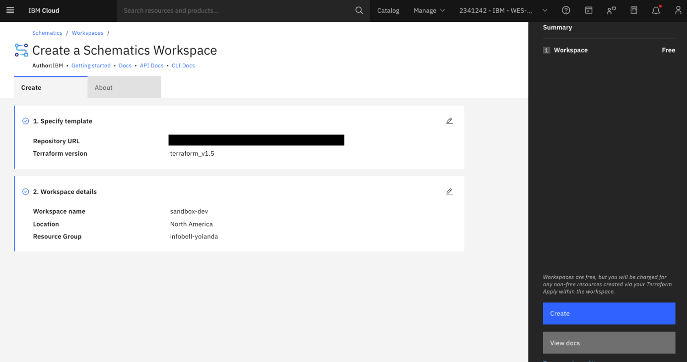
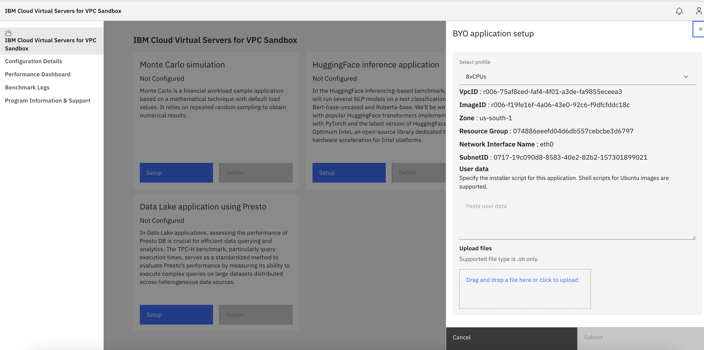
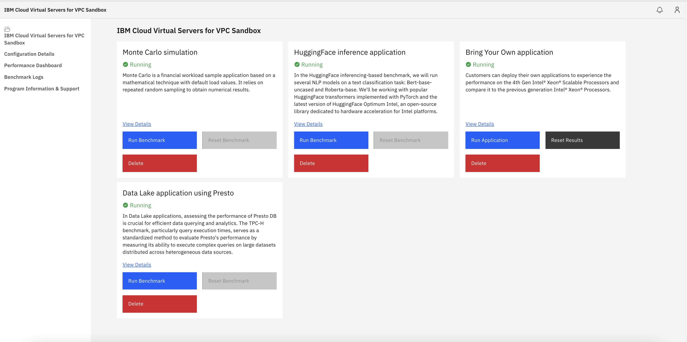
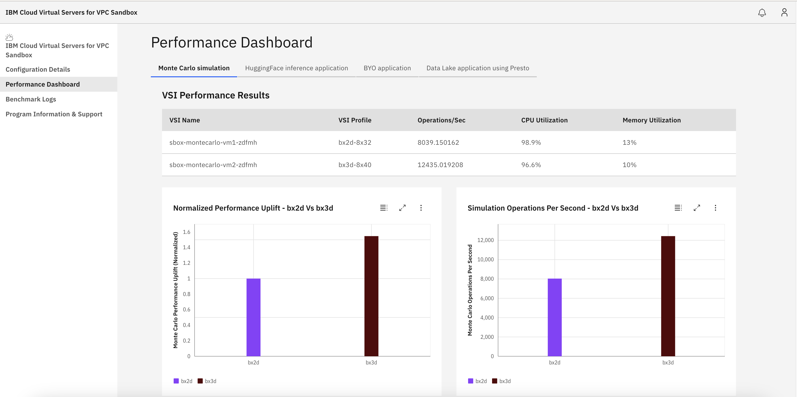
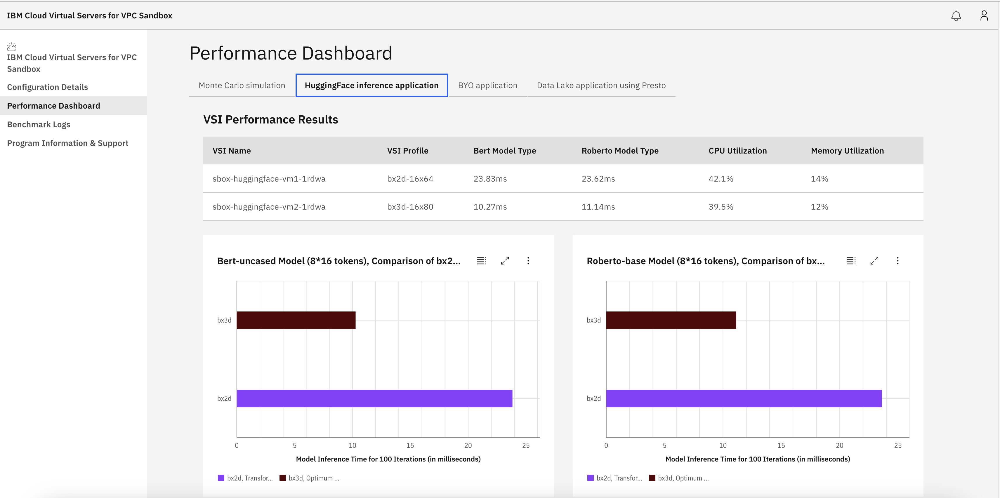
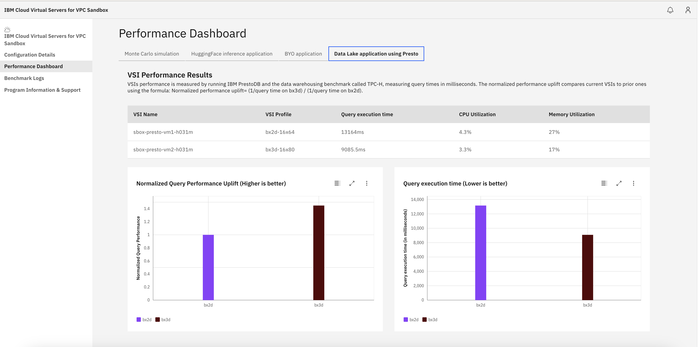

## IBM Cloud Virtual Servers for VPC Sandbox

### Introduction

The IBM Cloud VPC sandbox creates a nonproduction environment to quickly benchmark and compare various workloads' performance with IBM Cloud VSIs that are equipped with the latest Intel processors. You can run preselected workload benchmarks or deploy your application for performance evaluation.

This user guide provides you with step-by-step instructions for deploying the automation code to your IBM Cloud account and running performance benchmarks on Intel Cascade Lakes and Sapphire Rapids CPU.

This deployment uses Terraform and IBM Cloud Schematics as automation frameworks.

### Roles and responsibility
The IBM Cloud VPC sandbox is a customer-managed, automated deployment deployed into your IBM Cloud VPC account. You own the resources that the automated deployment creates and are responsible for managing them.

**NOTE:** To minimize cost, it is recommended that the resources be deleted after completion.

### Prerequisites

1. An IBM Cloud account to deploy IBM Cloud Virtual Servers for VPC Sandbox.
2. An IBM Cloud API key. For instructions, refer to [Create API Key](https://cloud.ibm.com/docs/account?topic=account-userapikey&interface=ui#create_user_key).
3. An IBM SSH key for the bastion host VSI and dashboard VSI. For instructions, refer to [Create SSH Key](https://cloud.ibm.com/docs/vpc?topic=vpc-ssh-keys&interface=ui).
4. The following permissions:
   
   | Service | Platform roles | Service roles | Reference links |
   |---|---|---|---|
   | All Account Management services | Administrator | | For [trusted profile](https://cloud.ibm.com/docs/account?topic=account-create-trusted-profile&interface=ui#tp-roles-reqs) |
   | IAM Identity Service | Administrator | | For [trusted profile](https://cloud.ibm.com/docs/account?topic=account-create-trusted-profile&interface=ui#tp-roles-reqs) |
   | IBM Log Analysis | Editor | Manager | [Log Analysis Access](https://cloud.ibm.com/docs/log-analysis?topic=log-analysis-work_iam#devops_account) |
   | VPC Infrastructure | Editor | Manager | [VPC Managing Access](https://cloud.ibm.com/docs/vpc?topic=vpc-iam-getting-started&interface=ui) | 

### High-level flow for deploying and using the sandbox environment

This section outlines a top-level overview, showcasing the entire journey for you to deploy
the IBM Cloud VPC sandbox.

#### Step 1: Deploy IBM Cloud VPC sandbox deployment using IBM Cloud Schematics

- Log in to the IBM Cloud account and select the IBM Cloud Schematics service.
- Create an IBM Cloud Schematics workspace with the sandbox GitHub repository and deploy the IBM
  Cloud VPC sandbox. Refer to [VPC sandbox deployment step 3](#ibm-cloud-virtual-servers-for-vpc-sandbox-deployment) for more details on the required input variables. This process takes approximately 20 minutes.

#### Step 2: Setup application VSIs from sandbox dashboard portal

- Access the sandbox dashboard from a local browser by using '<http://localhost:38080>' and log in
  with 'admin' credentials.
- Deploy the application VSIs by clicking **Setup**.

#### Step 3: Run preselected benchmark application or user application

- After setup completion, run the benchmark applications.

#### Step 4: Evaluate performance data

- Navigate to the performance dashboard page and evaluate performance data for preselected
  benchmark applications or user application.

#### Step 5: Delete application VSIs

- After evaluating performance data, delete the application VSIs.

> **Important note:** When you run the IBM Cloud Virtual Servers for VPC Sandbox,
you incur the respective costs for the IBM Cloud resources used. To minimize the costs of
running the sandbox, use the "Delete process” after every application that you set up and
run in the sandbox dashboard to evaluate performance. After you delete the individual sandbox
applications VSIs resources, you must also delete the corresponding workspace environment
separately by using IBM Cloud Schematics capability to eliminate incurring any costs for the sandbox.
IBM Schematics will not delete application VSIs created from the sandbox dashboard. Delete them from 
the sandbox dashboard only.

#### Step 6: Destroy IBM Cloud VPC sandbox resources through IBM Schematics and delete the workspace

- After the application VSIs are deleted, destroy the IBM Cloud VPC sandbox resources and delete
  the IBM Schematics workspace.

### Detail flow for deploying and using the sandbox environment
This section describes the process of using the IBM Cloud VPC sandbox environment.

#### IBM Cloud VPC sandbox deployment using IBM Cloud Schematics

1. Log into your IBM Cloud account and select the Schematics service to deploy the sandbox
   workspace environment.


2. Create a Schematics workspace and deploy the IBM Cloud sandbox environment with the
   IBM-provided GitHub URL where the Terraform module exists. The repository located at
   <https://github.com/IBM-Cloud/sandbox-benchmark-for-vpc> is used in Schematics Workspace.



3. After you create the sandbox workspace, provide the required inputs in the IBM Schematics for
   Terraform module and click "Apply plan" to deploy the sandbox environment:
   - **ibmcloud_api_key**: Obtain this value by completing the prerequisites.
   - **ibmcloud_ssh_key_name**: Obtain this value by completing the prerequisites. Additionally,
     download the SSH private key, which is used to log in to the bastion host.
   - **resource_group**: Obtain this value by completing the prerequisites.
   - **personal_access_token**: Obtain this value by completing the prerequisites. Internal IBM
     use only
   - **zones**: `["us-south-1"]`
     Optionally, you can choose `us-south-2` or `us-south-3`.
   - **remote_allowed_ips**: To access the sandbox dashboard, provide your current public
     IP address. If you're unsure how to find it, you can use an online service such as 'What is
     my IP' or consult your internet service provider. After you obtain your public IP
     address, format it as follows: `["PublicIP"]`.
   - **logdna_integration**: Set to `true`.
     You can choose false if you don't want LogDNA integration.
   - **logdna_plan**: Set to `lite`
     Valid options are `lite`, `7-day`, `14-day`, `30-day`, `hipaa`.
   - **sandbox_ui_repo_url**: Set to `https://github.com/IBM-Cloud/sandbox-benchmark-dashboard-for-vpc/archive/refs/heads/main.zip`
   - **sandbox_uipassword**: Provide the sandbox dashboard password.

   The repository located at <https://github.com/IBM-Cloud/sandbox-benchmark-dashboard-for-vpc> is
   used for setting up the sandbox dashboard application.
   
   **NOTE:** For sensitive data, it is recommended to check the "Sensitive" box.


4. After a successful "Apply plan", you get the sandbox **access_info** command in the Terraform
   output. You can use the **access_info** command in your local terminal and access the sandbox
   environment from your browser. See the following sample `access_info` command output:

   `ssh -i [SSHKeyPath] -o StrictHostKeyChecking=no -o UserKnownHostsFile=/dev/null -L
   38080:[DashboardIP]:80 root@[BastionHostIP]`

   SSHKeyPath is a private SSH key path that you passed in the Terraform module to
   access the bastion host. If you don't have any SSH keys created or downloaded, you can
   create an SSH key and use the same key for the sandbox environment.

    > NOTE: Don't attach public IP (FIP) to the dashboard VSI to access the sandbox without the
    > bastion host. **The setup of the sandbox application will take approximately 15 minutes
    > after the apply plan shows successful.** You can view the logs in LogDNA instance. See
    > [View LogDNA Logs](https://cloud.ibm.com/docs/log-analysis?topic=log-analysis-launch)

    After the command runs successfully, the tunnel is set up between the local machine and the
    bastion host. The sandbox dashboard can be accessed from the local browser by running the
    following command:

    `http://localhost:38080`

    If the apply plan fails, check the errors in the Terraform outputs.

**Apply plan shows successful:**

You can get the `access_info` command details from the Terraform outputs as shown in the following
screenshot.


5. You can enter the following URL in your browser, explore the sandbox dashboard portal, and
   deploy preselected applications, VSIs, and their own workloads: `http://localhost:38080`

**Sandbox dashboard portal login page**

For logging into the sandbox dashboard, use the default username, viz. \'**admin**\' and use the
password that was passed by you during the Terraform basic infrastructure deployment.


After a successful log in, you can explore the sandbox dashboard and deploy the application
workloads to evaluate the performance differences between IBM Cloud VPC SPR and CLX instances.


**Pre-selected performance applications or workloads**

The sandbox targets two application workloads and one customer-owned application.

1. **Monte Carlo simulation:** It is a financial workload sample app based on mathematical
    technique with some default load values that rely on repeated random sampling to obtain
    numerical results. This provides the operations per second as a performance metric and the API
    captures memory utilization and CPU utilization as well for each benchmark run.

    In a Monte Carlo workload, 8 or 16 vCPUs VSIs profiles of SPR (Bx3d-8x40 or Bx3d-16x80) and CLX
    (Bx2d-8x32 or Bx2d-16x64) are deployed and used. It creates two VSIs: CLX-based VSIs
    and SPR-based VSIs.

    Reference: [Monte Carlo Simulation](https://github.com/intel/Financial-Services-Workload-Samples/tree/main/MonteCarloEuropeanOptions)

2. **HuggingFace Inference Application:** The HuggingFace inference-based benchmark runs several
    NLP models on a text classification task: Bert-base-uncased and Roberta-base. Working with
    popular HuggingFace transformers implemented with PyTorch and the latest version of
    HuggingFace Optimum Intel, HuggingFace is an open-source library dedicated to hardware 
    acceleration for Intel platforms.

    For a HuggingFace workload, the 16 vCPUs VSIs profiles of SPR (Bx3d-16x80) and CLX (Bx2d-16x64)
    are deployed and used. It creates two VSIs: CLX-based VSIs and SPR-based VSIs.

    Reference: [HuggingFace](https://huggingface.co/blog/intel-sapphire-rapids-inference)

3. **Bring Your Own (BYO) application:** You can deploy your own applications to experience the
    performance of the latest generation SPR VSIs and compare it to the previous generation CLX
    VSIs. You can enter or upload your installer and runner file from the dashboard UI to
    install or run your application. The only supported format is shell scripts.

    For a BYO application workload, you are provided with 8 or 16 vCPUs VSIs profiles of SPR-based
    (Bx3d-8x40 or Bx3d-16x80) and CLX-based (Bx2d-8x32 or Bx2d-16x64). It creates two VSIs: one
    CLX-based VSI and SPR-based VSI.

4. **Data Lake application using Presto:** In Data Lake applications, assessing the performance of
   Presto DB is crucial for efficient data querying and analytics. The TPC-H benchmark serves as a
   standardized method to evaluate Presto's performance by measuring its ability to run
   complex queries on large datasets distributed across heterogeneous data sources. Running TPC-H
   queries on Presto is crucial for assessing query execution time, which is essential for
   decision support workloads in Data Lake environments. The Benchto project aims to simplify the
   process of defining, running, and analyzing macro benchmarks. It acknowledges that
   understanding the behavior of distributed systems is challenging and requires clear visibility
   into the cluster's state and the internals of the tested system. This project was developed for
   repeatable benchmarking of Hadoop SQL engines, most importantly [PrestoDB](https://prestodb.io/).

   For a Presto workload, the 16 vCPUs VSIs profiles of SPR (Bx3d-16x80) and CLX (Bx2d-16x64)
   are deployed and used. It creates two VSIs: CLX-based VSI and SPR-based VSI.

    Reference: [Presto](https://github.com/prestodb/presto), [Benchto](https://github.com/prestodb/benchto), [Hadoop](https://hadoop.apache.org/), [Hive](https://hive.apache.org/)

**NOTE:** The IBM Cloud sandbox uses a **Ubuntu 22.04** image for running all
the performance benchmarks. Make sure your BYO application and related runner scripts run
successfully in the Ubuntu 22.04 operating system.

### Deploying applications or workloads

1. **Setting up the application VSIs:** You can deploy the VSIs for the selected application or
   workload from the dashboard portal. You can select the VSI profiles and initiate setup of the
   preselected applications or workloads VSIs. It takes around 7-8 minutes to create the VSIs and
   then deploy the preselected application or workloads. You can view the status of the VSIs by
   navigating to the Configurations Details page.


You can select the VSIs profiles for application workloads.


**Installing and setting up the BYO application:**

When you initiate a setup for the BYO application, you can pass a user-data script to install and set up your workload application. The only supported format is shell scripts. This user-data is executed by cloud-init in the VSI and copied to
the /var/lib/cloud/instance/ directory. You can find the execution logs of the user-data script
in the /var/log/cloud-init-output.log file in the BYO application VSIs. Optionally, you can set up the IBM
Cloud LogDNA service with BYO application VSIs to see the application installation logs.

The following example is a sample installation script for BYO application. The sample script also shows how to
set up up LogDNA Service if needed. You need to get the **LOGDNA_INGESTION_KEY** from LogDNA service
and then replace it in the following script to enable the LogDNA for the BYO application VSIs.

**Sample script to install the user's workload:** The following script is a sample
only; your script for your application might vary.

```
#!/bin/bash
echo "deb https://assets.logdna.com stable main" | sudo tee /etc/apt/sources.list.d/logdna.list
wget -O- https://assets.logdna.com/logdna.gpg | sudo apt-key add -
sudo apt-get update -y
sudo DEBIAN_FRONTEND=noninteractive apt-get install logdna-agent -y
sudo bash -c 'cat << EOF > /etc/logdna.env
LOGDNA_HOST="logs.REGION.logging.cloud.ibm.com"
LOGDNA_ENDPOINT=/logs/agent
LOGDNA_INGESTION_KEY="LOGDNA_INGESTION_KEY"
EOF'
sudo systemctl restart logdna-agent
sudo systemctl status logdna-agent
sudo systemctl enable logdna-agent

sudo DEBIAN_FRONTEND=noninteractive apt-get upgrade -y

# Install intel libraries
sudo DEBIAN_FRONTEND=noninteractive apt-get -yq install intel-mkl g++ libtbb-dev libomp-13-dev
sudo ln -s /usr/lib/x86_64-linux-gnu/libmkl_intel_ilp64.so /usr/lib/x86_64-linux-gnu/libmkl_intel_ilp64.so.2
sudo ln -s /usr/lib/x86_64-linux-gnu/libmkl_sequential.so /usr/lib/x86_64-linux-gnu/libmkl_sequential.so.2
sudo ln -s /usr/lib/x86_64-linux-gnu/libmkl_core.so /usr/lib/x86_64-linux-gnu/libmkl_core.so.2

#User can add their script below to build and install BYO application binary
```

**Entering or uploading the BYO application script:** Enter your BYO application install and setup script in the BYO
application and environment details page. See the following:



The status of the application VSIs in Configuration Details page:


2. **Running the benchmark:** After successful creation of VSIs, you can run the benchmark for the
selected application or workload from the dashboard portal. For a Monte Carlo application, run
benchmark takes around 30-45 seconds; for HuggingFace, it takes around 2 minutes; and for
the Presto application, you have the flexibility to choose which queries to run. Each
individual query typically requires 2-5 minutes to complete, while running all queries
collectively usually takes around 15 minutes.



**BYO application Run Benchmark:** On the BYO application "Run benchmark" page, you can pass the .sh runner
script to run the BYO application.


The only supported format is shell scripts.

The following script is a sample only; your script for your application might vary.

```
#!/bin/bash

# Enter your BYO application run script here
```

You can navigate to the Performance Dashboard page for every run benchmark result and compare the
performance uplift between the SPR and CLX VSIs.

3. **Performance Dashboards**

Application performance dashboard can help you to gain valuable insights into the CLX and SPR
performance uplift, enabling proactive monitoring.

**Monte Carlo Simulation Performance Dashboard:**

The graph visualizes the normalized performance uplift and simulation operations per second for
the VSIs that have been created during the deployment.

In the following sample, the x-axis represents time, the left y-axis represents normalized performance
uplift (percentage), and the right y-axis represents simulation operations per second. Each line
represents the trend of its respective metric over time.



**HuggingFace Inference Application Performance Dashboard:**

The graph visualizes the Model Inference Time for 100 Iterations (in milliseconds) for the
Bert-base-uncased Model and Roberto-base Model for the VSIs created during the deployment.

In the following sample, the x-axis represents Model Inference Time for 100 Iterations (in milliseconds),
the left y-axis represents VSIs name, and the right y-axis also represents VSIs name. Each line
represents the trend of its respective metric over time.



**BYO Application Performance Dashboard:**

The following is a Performance Dashboard that allows you to quickly compare the average utilization metrics for
memory, CPU, network, and I/O across different BYO application VSIs in the table. Additionally, the graph
visualizes the current and maximum utilization metrics for memory and cpu, providing a more
comprehensive view of usage.


**Data Lake application using Presto Performance Dashboard:**

VSIs performance is measured by running IBM PrestoDB and the data warehousing benchmark called
TPC-H, measuring query times in milliseconds. The normalized performance uplift compares current
VSIs to prior ones using the formula:
Normalized performance uplift = (1/query time on bx3d) / (1/query time on bx2d).
The graph visualizes the normalized performance uplift and query execution
time for the VSIs that are created during the deployment.

In the following sample, the x-axis represents time, the left y-axis represents normalized performance
uplift (percentage), and the right y-axis represents query execution time. Each line represents
the trend of its respective metric over time.



4. **Benchmark Logs**

The dashboard provides an overview of all executed benchmarks. Each benchmark entry includes key
information such as benchmark name, date executed, status, category and VSI name. Status of each
benchmark can be seen in the following screenshot. You have the option to download the benchmark log report for
each executed benchmark. Page navigation functionality has been added to enhance the user experience.


5. **Reset and delete the application or workload VSIs:**

Complete the followings steps to reset benchmark data and delete application VSIs from the
dashboard portal:

- Click the reset action: You can **reset** the benchmark data for the application workload for
the application VSIs for the selected application from the dashboard portal.

- Click the delete action, A confirmation dialog displays, which includes a message about the
action you are about to take. You need to mention "Delete" before proceeding further with VSI
deletion. It takes around 2-3 minutes to delete the VSIs for the selected application.


6. **Destroy IBM Cloud VPC sandbox resources via IBM Schematics and delete the workspace**

- Go to your IBM Schematics workspace and destroy the IBM Cloud sandbox environment.


- Once the sandbox resources are destroyed, you can delete the IBM Schematics workspace.


### Troubleshooting and FAQs

If you're unable to find a solution to your problem or have a question that's not listed in the
[FAQs](./sandbox-faqs.md), you can report a problem, provide suggestions, or comments regarding
the IBM Cloud Virtual Servers for VPC Sandbox and open a GitHub issue on the IBM Sandbox
Repository at <https://github.com/IBM-Cloud/sandbox-benchmark-for-vpc/issues>. All issues will be
addressed in a best effort by developers.

### Support

Though the materials provided herein are not supported by the IBM Service organization, your
comments are welcomed by the developers, who reserve the right to revise or remove the materials
at any time. For reporting a problem, providing suggestions, or comments regarding the IBM Cloud
Virtual Servers for VPC Sandbox, you can open a GitHub issue on the IBM Sandbox Repository at
<https://github.com/IBM-Cloud/sandbox-benchmark-for-vpc/issues>. All issues will be addressed in a
best effort by developers.

There are no warranties of any kind, and there is no service or technical support
available for these materials from IBM. As a recommended practice, carefully review any materials
before using them.

### Glossary

- SPR: Sapphire Rapids is a codename for Intel's server (fourth generation Xeon Scalable) and
  workstation processors based on Intel 7
- CLX: Cascade lake is 2nd Generation Intel® Xeon® Scalable Processors
- VPC - Virtual Private Cloud
- VSI - Virtual Server Instance
