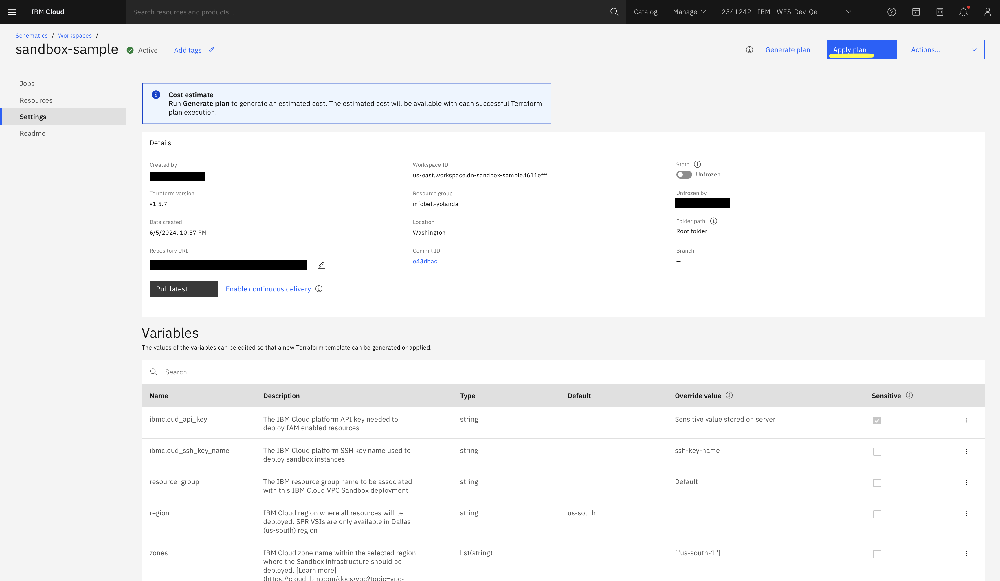
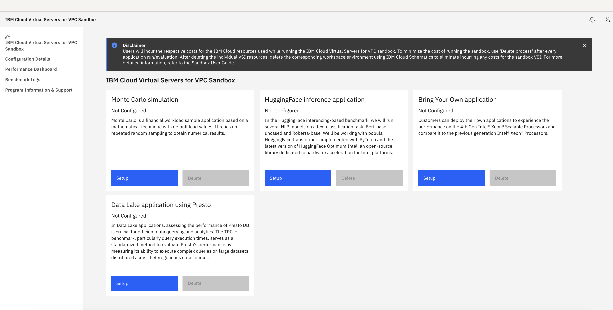
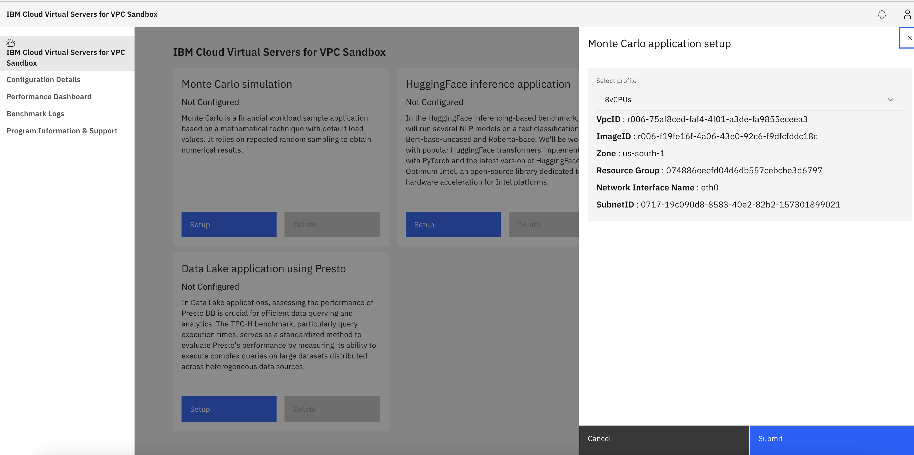
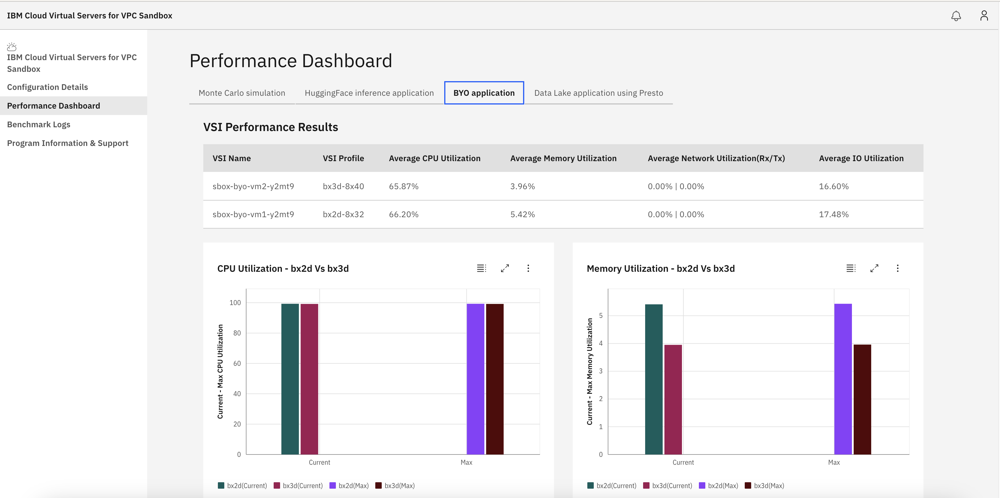

## IBM Cloud Virtual Servers for VPC Sandbox

### Introduction

IBM Cloud VPC sandbox not only showcases the technological advancements of IBM Cloud but also
reinforces its commitment to providing a playground for user-centric innovation and hands-on
learning.

### Prerequisite

1. You should have an IBM Cloud account to deploy IBM Cloud Virtual Servers for VPC sandbox.

2. You should have an IBM Cloud API key to enable Terraform connection to the IBM Cloud
   Terraform provider. This API key facilitates resource provisioning under the user's
   identity. Refer to [Create API Key](https://cloud.ibm.com/docs/account?topic=account-userapikey&interface=ui#create_user_key) for instructions.

3. You should have an IBM SSH key for both the bastion Host VSI and dashboard VSI. Refer to
   [Create SSH Key](https://cloud.ibm.com/docs/vpc?topic=vpc-ssh-keys&interface=ui) for instructions.

4. You should have IBM Resource Group permissions to provision the VPC infrastructure, IBM Cloud Trusted profiles and LogDNA
   instance. Refer to [Create Resource Group](https://cloud.ibm.com/docs/account?topic=account-rgs&interface=ui) for instructions.

5. You should have a Personal Access Token to pull GitHub repositories. This token is only
   applicable for IBM internal GitHub repositories. Refer to [Create Personal Access Token](https://docs.github.com/en/enterprise-server@3.9/authentication/keeping-your-account-and-data-secure/managing-your-personal-access-tokens) for instructions.

### Purpose of the IBM Cloud Virtual Servers for VPC sandbox

The IBM Cloud VPC sandbox is a customer managed, automated deployment/configuration, that is
deployed into your IBM account using the virtual server instances (VSIs). Resources that are
created by the automated deployment are owned by you. Management of those resources is your
responsibility. IBM creates and configures the sandbox installation and infrastructure required by
using best practices.

The goal of the sandbox is to provide a non-production playground environment, enabling you to
quickly benchmark various workloads for their performance on the latest IBM Cloud VSIs. You can
run pre-selected workload benchmarks or deploy your own application workloads for performance
evaluation.

### User Journey

This section outlines a top-level overview, showcasing the entire journey for the user to deploy
the IBM Cloud VPC sandbox.

#### Step 1: Deploy IBM Cloud VPC sandbox deployment using IBM Cloud Schematics

- Log in to the IBM Cloud account and select the IBM Cloud Schematics service.
- Create an IBM Cloud Schematics workspace with the sandbox GitHub repository and deploy the IBM
  Cloud VPC sandbox.Please refer [VPC sandbox deployment step 3 ](#ibm-cloud-virtual-servers-for-vpc-sandbox-deployment) for more details on the required input variables. This process takes approximately 20 minutes.

#### Step 2: Setup application VSIs from sandbox dashboard portal

- Access the sandbox dashboard from a local browser using '<http://localhost:38080>' and log in
  with 'admin' credentials.
- Deploy the application VSIs by clicking on the Setup button.

#### Step 3: Run preselected benchmark application or user application

- After setup completion, run the benchmark applications.

#### Step 4: Evaluate performance data

- Navigate to the performance dashboard page and evaluate performance data for preselected
  benchmark applications or user application.

#### Step 5: Delete Application VSIs

- After evaluating performance data, delete the application VSIs.

Important Note: Please note that when you run the IBM Cloud Virtual Servers for VPC sandbox, you
will incur the respective costs for the IBM Cloud resources used.  To minimize the costs of
running the sandbox, please use the "Delete process” after every application that you setup and
run in the sandbox dashboard to evaluate performance. After deleting the individual sandbox
applications VSIs resources, you must also delete the corresponding workspace environment
separately using IBM Cloud Schematics capability to eliminate incurring any costs for the sandbox.
IBM Schematics will not delete application VSIs created from the sandbox dashboard. Users must
delete them from the sandbox dashboard only.

#### Step 6: Destroy IBM Cloud VPC sandbox resources via IBM Schematics and delete the workspace

- Once the application VSIs are deleted, destroy the IBM Cloud VPC sandbox resources and delete
  the IBM Schematics workspace.

### IBM Cloud Virtual Servers for VPC sandbox deployment

This section describes the process of using the IBM Cloud VPC sandbox environment.

#### IBM Cloud VPC sandbox deployment using IBM Cloud Schematics

1. Log into your IBM Cloud account and select the Schematics service to deploy the sandbox
   workspace environment.


2. Create a Schematics workspace and deploy the IBM Cloud sandbox environment with the
   IBM-provided GitHub URL where the Terraform module exists. The repository located at
   <https://github.com/IBM-Cloud/sandbox-benchmark-for-vpc.git> will be used in Schematics Workspace.


3. After you create the sandbox workspace, provide the required inputs in the IBM Schematics for
   Terraform module and click "Apply plan" to deploy the sandbox environment. Here are the
   necessary input variables:
   - **ibmcloud_api_key**: Obtain this value by completing the prerequisites.
   - **ibmcloud_ssh_key_name**: Obtain this value by completing the prerequisites. Additionally,
     download the SSH private key, which will be used to log in to the Bastion host.
   - **resource_group**: Obtain this value by completing the prerequisites.
   - **personal_access_token**: Obtain this value by completing the prerequisites, Internal IBM use only.
   - **zones**: `["us-south-1"]`
     Optionally, you can choose `us-south-2` or `us-south-3`.
   - **remote_allowed_ips**: Your Public IP address, from which you intend to access the sandbox
     dashboard, should be provided in this format: `["PublicIP"]`.
   - **logdna_integration**: Set to `true`.
     You can choose false if you don't want LogDNA integration.
   - **logdna_plan**: Set to `lite`
     Valid options are `lite`, `7-day`, `14-day`, `30-day`, `hipaa`.
   - **sandbox_ui_repo_url**: Set to `https://github.com/IBM-Cloud/sandbox-benchmark-dashboard-for-vpc/archive/main.zip`
   - **sandbox_uipassword**: Provide the sandbox dashboard password

   The repository located at <https://github.com/IBM-Cloud/sandbox-benchmark-dashboard-for-vpc.git> will be
   used for setting up the sandbox dashboard application.



4. After a successful "Apply plan", you get the sandbox **access_info** command in the Terraform
   output. You can use the **access_info** command in your local terminal and access the sandbox
   environment from your browser. See the following sample access_info command output:

   `ssh -i [SSHKeyPath] -o StrictHostKeyChecking=no -o UserKnownHostsFile=/dev/null -L
   38080:[DashboardIP]:80 root@[BastionHostIP]`

   SSHKeyPath would be ssh-key private key path which you have passed in Terraform module to
   access the Bastion host. If you don't have any ssh-key created/downloaded before, you can
   create one ssh-key first and use the same key for sandbox environment.

    > NOTE: Don't attach Public IP (FIP) to the dashboard VSI to access the sandbox without
    > Bastion host. **The setup of the sandbox application will take approximately 15 minutes
    > after the apply plan shows successful.** You can view the logs in LogDNA instance also. See
    > [View LogDNA Logs](https://cloud.ibm.com/docs/log-analysis?topic=log-analysis-launch)

    After the command runs successfully, the tunnel is set up between the local machine and the
    bastion host. The sandbox dashboard can be accessed from the local browser by running the
    following command:

    `http://localhost:38080`

    If the apply plan fails, please check the errors in the Terraform outputs.

**Apply plan shows successful:**

You can get the access_info command details from the Terraform outputs as shown in below
screenshot.


5. You can enter the following URL in your browser, explore the sandbox dashboard portal, and
   deploy preselected applications, VSIs, and their own workloads.

    `http://localhost:38080`

**Sandbox dashboard portal login page**

For logging into the sandbox dashboard, use the default username, viz. \'**admin**\' and use the
password that was passed by you during the Terraform basic infrastructure deployment.


After a successful log in, you can explore the sandbox dashboard and deploy the application
workloads to evaluate the performance differences between IBM Cloud VPC SPR and CLX instances.



**PreSelected Performance Applications or Workloads**

The sandbox targets two application workloads and one customer-owned application.

1. **Monte Carlo Simulation:** It is a Financial Workload sample app based on mathematical
    technique with some default load values that rely on repeated random sampling to obtain
    numerical results. This will provide the Operations per Second as a performance metric and API
    will capture Memory Utilization, CPU Utilization as well for each benchmark run.

    In Monte Carlo workload, 8 or 16 vCPUs VSIs profiles of SPR (Bx3d-8x40 or Bx3d-16x80) and CLX
    (Bx2d-8x32 or Bx2d-16x64) will be deployed and used. It will create two VSIs - CLX-based VSIs
    and SPR-based VSIs.

    Reference: [Monte Carlo Simulation](https://github.com/intel/Financial-Services-Workload-Samples/tree/main/MonteCarloEuropeanOptions)

2. **HuggingFace Inference Application:** The HuggingFace inference-based benchmark runs several
    NLP models on a text classification task: Bert-base-uncased and Roberta-base. Working with
    popular HuggingFace transformers implemented with PyTorch and the latest version of
    HuggingFace Optimum Intel, an open-source library dedicated to hardware acceleration for Intel
    platforms.

    For HuggingFace workload, the 16 vCPUs VSIs profiles of SPR (Bx3d-16x80) and CLX (Bx2d-16x64)
    will be deployed and used. It will create two VSIs - CLX-based VSI and SPR-based VSI.

    Reference: [HuggingFace](https://huggingface.co/blog/intel-sapphire-rapids-inference)

3. **Bring Your Own (BYO) Application:** Users can deploy their own applications to experience the
    performance of the latest generation SPR VSIs and compare it to the previous generation CLX
    VSIs. Users can enter/upload their installer and runner file from the dashboard UI to
    install/run their application. Only supported format is shell scripts.

    For BYO Application workload, the user is provided with 8 or 16 vCPUs VSIs profiles of SPR-based
    (Bx3d-8x40 or Bx3d-16x80) and CLX-based (Bx2d-8x32 or Bx2d-16x64). It will create two VSIs, one
    CLX-based VSI and SPR-based VSI.

**NOTE:** The IBM Cloud sandbox uses **Ubuntu 22.04** image for executing all
the performance benchmarks. Please make sure your BYO application and related runner scripts run
successfully in the Ubuntu 22.04 operating system.

### Deploying applications or workloads

1. **Setting up the application VSIs:** You can deploy the VSIs for the selected application or
   workload from the dashboard portal. You can select the VSI profiles and initiate setup of the
   preselected applications or workloads VSIs. It takes around 7-8 minutes to create the VSIs and
   then deploy the preselected application or workloads. You can view the status of the VSIs by
   navigating to the Configurations Details page.


You can select the VSIs profiles for application workloads.



**Installing and setting up the BYO application:**

When you initiates a setup for the BYO application, it allows you an option to pass a
user-data script to install and set up their workload application. The only supported format is
shell scripts. This user-data will be executed by cloud-init in the VSI and copied to
the /var/lib/cloud/instance/ directory. You can find the execution logs of the user-data script
in the /var/log/cloud-init-output.log file in the BYO application VSIs. Optionally, you can setup the IBM
Cloud LogDNA service with BYO application VSIs to see the application installation logs.

Below is the sample installation script for BYO application. The sample script also shows how to
setup up LogDNA Service if needed. You need to get the **LOGDNA_INGESTION_KEY** from LogDNA service
and then replace it in the below script to enable the LogDNA for the BYO Application VSIs.

**Sample script to install the user's workload:** Please note that the script below is a sample
only, your script for your application may vary.

```
#!/bin/bash
echo "deb https://assets.logdna.com stable main" | sudo tee /etc/apt/sources.list.d/logdna.list
wget -O- https://assets.logdna.com/logdna.gpg | sudo apt-key add -
sudo apt-get update -y
sudo DEBIAN_FRONTEND=noninteractive apt-get install logdna-agent -y
sudo bash -c 'cat << EOF > /etc/logdna.env
LOGDNA_HOST="logs.REGION.logging.cloud.ibm.com"
LOGDNA_ENDPOINT=/logs/agent
LOGDNA_INGESTION_KEY="LOGDNA_INGESTION_KEY"
EOF'
sudo systemctl restart logdna-agent
sudo systemctl status logdna-agent
sudo systemctl enable logdna-agent

sudo DEBIAN_FRONTEND=noninteractive apt-get upgrade -y

# Install intel libraries
sudo DEBIAN_FRONTEND=noninteractive apt-get -yq install intel-mkl g++ libtbb-dev libomp-13-dev
sudo ln -s /usr/lib/x86_64-linux-gnu/libmkl_intel_ilp64.so /usr/lib/x86_64-linux-gnu/libmkl_intel_ilp64.so.2
sudo ln -s /usr/lib/x86_64-linux-gnu/libmkl_sequential.so /usr/lib/x86_64-linux-gnu/libmkl_sequential.so.2
sudo ln -s /usr/lib/x86_64-linux-gnu/libmkl_core.so /usr/lib/x86_64-linux-gnu/libmkl_core.so.2

#User can add their script below to build and install BYO application binary
```

**Entering or uploading the BYO application script:** Enter your BYO application install and setup script in the BYO
application and environment details page. See below.


The status of the application VSIs in Configuration Details page shown as below:


2. **Running the Benchmark:** After successful creation of VSIs, you can run the benchmark for
the selected application or workload from the dashboard portal. For Monte Carlo application, run
benchmark will take around 30-45 seconds and for HuggingFace, it will take around 2 minutes.


**BYO Application Run Benchmark:** On the BYO application Run benchmark page, you can pass the .sh runner
script to run their BYO application.


The only supported format is shell scripts.

Please note that the script below is a sample only, your script for your application may vary.

```
#!/bin/bash

# Enter your BYO application run script here
```

You can navigate to the Performance Dashboard page for every run benchmark result and compare the
performance uplift between the SPR vs CLX VSIs.

3. **Performance Dashboards**

Application performance dashboard can help you to gain valuable insights into the CLX vs SPR
performance uplift, enabling proactive monitoring.

**Monte Carlo Simulation Performance Dashboard:**

The graph visualizes the Normalized Performance uplift and Simulation operations per second for
the VSIs that have been created during the deployment.

In below sample, the x-axis represents time, the left y-axis represents Normalized Performance
Uplift (percentage), and the right y-axis represents Simulation Operations per second. Each line
represents the trend of its respective metric over time.


**HuggingFace Inference Application Performance Dashboard:**

The graph visualizes the Model Inference Time for 100 Iterations(in milliseconds) for the
Bert-base-uncased Model and Roberto-base Model for the VSIs created during the deployment.

In below sample, the x-axis represents Model Inference Time for 100 Iterations(in milliseconds),
the left y-axis represents VSIs name and the right y-axis also represents VSIs name. Each line
represents the trend of its respective metric over time.


**BYO Application Performance Dashboard:**

Below Performance Dashboard allows you to quickly compare the average utilization metrics for
memory, cpu, network, and I/O across different BYO application VSIs in the table. Additionally, the graph
visualizes the current and maximum utilization metrics for memory and cpu, providing a more
comprehensive view of usage.



4. **Benchmark Logs**

The dashboard provides an overview of all executed benchmarks. Each benchmark entry includes key
information such as benchmark name, date executed, status, category and VSI name. Status of each
benchmark can be seen as below. You have the option to download the benchmark log report for
each executed benchmark. Page navigation functionality has been added to enhance user experience.


5. **Reset and delete the application or workload VSIs:**

Complete the followings steps to reset benchmark data and delete application VSIs from the
dashboard portal:

- Click the Reset action: You can **reset** the benchmark data for the application workload for
the application VSIs for the selected application from the dashboard portal.

- Click the delete action, A confirmation dialog displays, which includes a message about the
action you are about to take. You need to mention "Delete" before proceeding further with VSI
deletion. It will take around 2-3 minutes to delete the VSIs for the selected application.


### Glossary

- SPR: Sapphire Rapids is a codename for Intel's server (fourth generation Xeon Scalable) and
  workstation processors based on Intel 7
- CLX: Cascade lake is 2nd Generation Intel® Xeon® Scalable Processors
- VPC - Virtual Private Cloud
- VSI - Virtual Server Instance

### Troubleshooting and FAQs

If you're unable to find a solution to your problem or have a question that's not listed in the
[FAQs](./sandbox-faqs.md), you can report a problem, provide suggestions, or comments regarding
the IBM Cloud Virtual Servers for VPC Sandbox and open a GitHub issue on the IBM Sandbox
Repository at <https://github.com/IBM-Cloud/sandbox-benchmark-for-vpc/issues>. All issues will be
addressed as best effort by developers.
